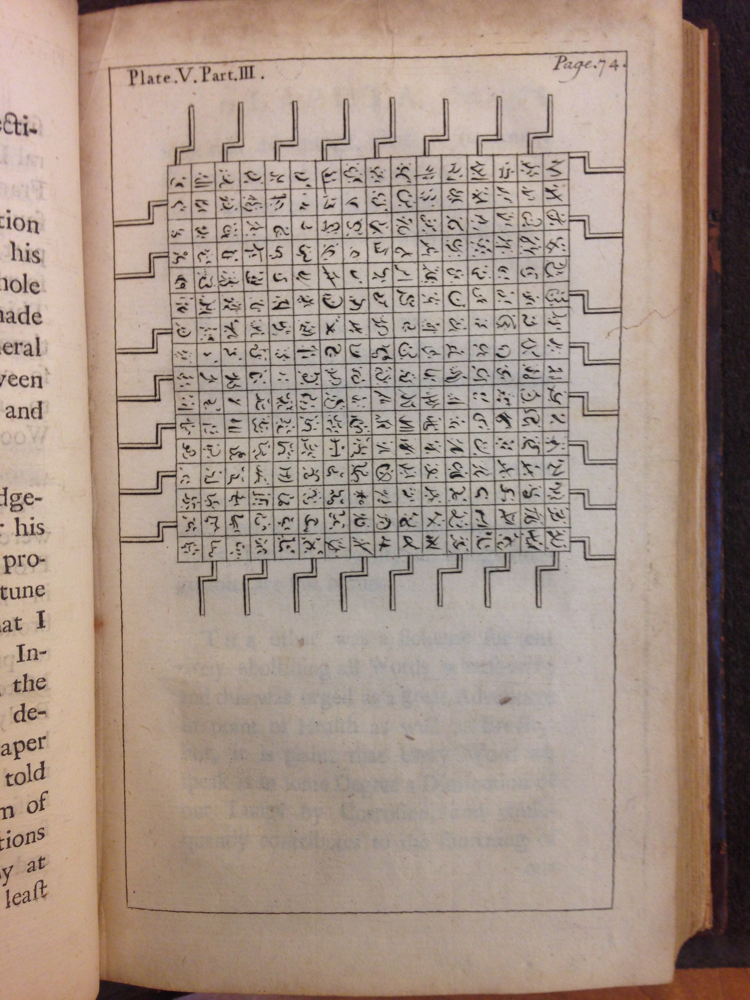

---
citation-style: chicago-fullnote-no-bibliography.csl
bibliography: research.bib
...

\setupindenting[yes,0.5in]
\setupinterlinespace[big]
\setupalign[flushleft,nothyphenated]
\setupheadertexts[\hfill][Ascher, Prospectus \pagenumber]
\setupwhitespace[none]
\setupfootnotes[location=text]
\setupheads[indentnext=yes]

# Argument

Caroline Levine's book, *Forms*, reminds us of the importance of
structure in literary, or any other kind of, text. She explains that
literature is made of language that uses what she calls forms: "an
arrangement of elements---an ordering, patterning, or
shaping."^[@levine15:forms p.3] She applies this concept of form to
whole, rhythm, hierarchy, and network, showing how they move from one
area to another. Because they travel across media and all aspects of
life, her forms tell us about the history of the culture around
them. That is, a pattern becomes a form when it becomes portable and
is imported to new situations, so the study of forms in literature can
tell us a great deal about the history forms in everyday life and
history.

The different patterns of visual layout in a printed text would seem
to be forms in Levine's sense. But, one might object that her forms
are far more abstract than printed pages, dealing with the content,
not the look of books. In this objection, content is somehow separate
from the physical container that transmits its meaning: a book merely
transmits language without a visual component, which--if you take a
second to think about it--is an absurd claim. The visual layouts of
marks forming texts have some bearing on how we understand their
meaning. At the very least, words employ letters in particular orders
and blank spaces of particular length to indicate their boundaries. We
can tell the difference between a header and the body text because of
spacing and size. We experience the form of certain typographical
features of a text in the past which we import to our expectations for
the look of a text we are reading now. The look of the book has some
bearing on meaning, yet the expectations of this look change over time.

This look of books has been investigated by a certain thread of
scholarship that would really like to be able to close read the visual
design of texts.  Nick Sousanis recently argued for a return to visual
storytelling as a way of "unflattening" our understanding of human
experience.^[@Sousanis15:Unflat] David Archibald, Bonnie Mak, and
Laura Mandell use the language of visual connoisseurship to explore
the role of images and layout in forming meaning, narrating ancestral
chains of similarity that carry us from medieval texts to the present
day.^[@Mak11:Page; @Archibald14:AristLadder; @mandel15:break] Stanley
Morison analyzes how Roman inscription invents imperial
authority. And, how this look was imported into early calligraphic
hands for the Bible as a bid for authority.^[@morison72:polscr]
Richard Wendorf has been studying the capitalization, typefaces, and
punctuation of eighteenth-century texts, identifying an "old" style of
frequent capitals, rhetorical punctuation, and uneven typefaces and a
"new" style of infrequent capitals, grammatical punctuation, and even
typefaces that come from the French printing
traditions.^[@wendorf00:abandon; @wendorf05:secretlife; @wendorf14:declaring]
Christopher Flint and Janine Barchas attempt to find historical bases
to read the visual components of literary texts. Both pay attention to
how marks in books came to be, but restrict their attention to how
literary genres take their visual cues from other books that come
before them in the same genre: novels from novels, poems from
poems.^[@Flint11:AppearPrint; @Barchas03:Graphic] In each of these
cases, the visual features are a form passing through
history. Although he does not use Levine's sense of form, the
framework for this sort of analysis of visual design was most
coherently sounded by G.T. Tanselle as part of bibliographical
analysis, bringing together a range of
techniques.^[@Tanselle09:BibAna]

Tanselle's work is particularly useful because many studies have not
fully integrated the methodology and---particularly---the *limits* of
the methodology of bibliographical analysis that he outlines. Tanselle
talks about *texts* and *works* in the same way that Levine talks
about forms: they are made up of discrete elements that link to
*thoughts*. He suggests that studying printing history, evidenced in
printed books, printers' manuals, and publications, illuminates a part
of culture through---what I am suggesting Levine would
call---forms. Studies such as Keith Maslen's demonstrate long and
close attention to features such as ornaments, but stop short of being
able to say a great deal about the culture beyond the particular
materials examined.^[@MaslenRichardson; @Maslen91:Bowyer] Broader
historical works like Percy Simpson's and Adrian Johns's critically
examine the capabilities for book production and how those affordances
connect to what people see in a finished
book.^[@JohnsNature; @Simpson70:ProofRead] Yet, philosophical readers
living in the seventeenth or eighteenth century seem to think of
design characteristics more like a language than like iconography or
pure history. The evidence of a book itself, combined with printers'
manuals and commentary about the look of books, should help to trace
the ideas that underlie how we might be able to close read visual
designs from a particular time period.

Thus, this dissertation explores the printed forms of meaning, their
function, and their portability across printed materials. The
introductory chapter looks at the *substance of meaning* in philosophy
after the Restoration. The substance of meaning gives way to *managing
meaning*. The second chapter gives a history of the text of the
*Philosophical Transactions*, a prominent effort to manage
meaning. Managing meaning happens concurrently with satirical and
provocative efforts to *disrupt meaning* which I discuss in the third
chapter through a history of *Hudibras* and Jonathan Swift's
circle. Concomitant with the management of meaning and the disruption
of meaning, others write to *subvert meaning* with parallel
commentaries in text. I trace these subversive commentaries through
the history of arguments in the manner of Cervantes. Lastly, I will
conclude with a discussion of the history of the method for describing
meaning in bibliography and criticism.

# 1. Introduction: Substance of Meaning

Perhaps because of the too-recent memory of the ideologically
motivated, physical violence of the Civil War, meaning seemed to take
on a physical form during the Restoration. Samuel Butler writes the
mock-epic *Hudibras* about the eponymous knight getting into unneeded
fights and how his confusion leads to comic violence. Part of the
humor, is that the knight considers himself wise:

{width=70%}

>| \noindentation His Notions fitted things so well,
>| That which was which he could not tell;
>| But oftentimes mistook the one
>| For th'other, as Great Clerks have done.
>| He could reduce all things to Acts
>| And knew their Natures by Abstracts,
>| Where Entity and Quiddity,
>| The Ghosts of defunct Bodies, flie;
>| Where Truth in Person does appear,
>| Like words congeal'd in Norther Air. ^[@butler67:hudib 1.1.139-148 p. 5]

\noindentation Butler's knight knows so much that he confuses words,
natures, and things. No wonder, since words sometimes become things
when they freeze solid in the air. Butler explains in a footnote in
the revised edition: "some report that in *Nova Zembla,* and
*Greenland,* Mens words are wont to be Frozen in the Air, and at the
Thaw may be heard."^[@butler67:hudib p. 5] These frozen words make a
solid thing that replaces the speaker in the future. Like Hudibras's
abstracts, words become the things themselves in their congealed
embodiment. Thomas Sprat describes the efforts of the Royal Society to
refine the language of knowledge: "They have attempted, to free it
[words and knowledge] from the Artifice, and Humors, and Passions of
Sects; to render it an Instrument, whereby Mankind may obtain a
Dominion over *Things*."^[@sprat58:history p. 62] Butler's attention
to abstracts as incomplete, yet preferred, replacements for things
also points to Sprat's and the Royal Society's effort to replace
experience with a concrete language.

According to Hans Aarsleff, much early seventeenth century etymology
and poetry relied on the concept of Adamic language which "sought to
imitate or recapture the natural perfection of Adam's language, on the
assumption that the elements of that language were still present in
the poet's own language."^[@Aarsleff82:LockeSaussure p. 19] Tapping
into a sense shared among the members of the Royal Society, including
Sprat, John Locke proposed an influential alternative to Adamic
language: "for without this *double conformity* of their *ideas,* they
find they should both think amiss of things themselves, and talk of
them unintelligibly to
others."^[@LockeEssayReading p. 386 II.32.§8.32] That is, words are
marks that correspond to ideas which themselves correspond to
things. The "double" of the conformity is that the words must
correspond to the ideas and that the ideas must correspond to the
things for communication to work. Hudibras makes an error by imagining
words linked directly to things and replacing them. This error gives
an analogy for the project, where Locke aligns word to idea to thing,
I think that readers and printers align visual marks to forms to memory.

To introduce my line of thinking, this chapter re-reads John Locke's
*Essay* through its revisions. Because the essay was famous almost
immediately, we have a rather complete record of the manuscripts and
correspondence around it. For example, we know that Locke inserted
marginal notes on the advice of William Molyneux: he had asked for
help removing the redundant passages and Molyneux suggested, instead,
that he provide guideposts so that readers could decide what they
wanted to read. This and other aspects of the revision show how
meaning had substance, was made substance, and how the substance of
meaning was extracted for this text which explicitly addresses the
form and substance of meaning after the Restoration.

# 2. Managing Meaning

To find a history of managing meaning, this chapter turns to the
history of a long-running source for visual features. Begun in 1665,
the *Philosophical Transactions* seems to visually report what was
verbally presented at the meetings of the Royal Society of London,
along with book reviews and letters. Yet, the printing history
suggests that something other than mere reporting was going on; the
*Transactions* was constructed by the Secretary for other
reasons. Carolyn Nelson and Matthew Seccombe have done some good
research into the printing history of the early years until 1700, but
the period of the eighteenth century remains relatively
unknown.^[@NelsonSeccombe87:BritishNewsp; @McLeodMcLeod82:GraphicalDirectory cover 1701-15 and argue for the rise in popularity during the reign of Queen Anne; @MaslenRichardson covers 1744-62 when Samuel Richardson printed the journal]
I propose to sketch the bibliographical and printing history of the
*Philosophical Transactions* from 1665 to 1753, when production was
taken over by a committee in the Royal
Society.^[@Kronick90:NotesPT is the preliminary study that helps me find the gaps here and @Todd65:GentMag guides my methodology]

Consider the management of meaning in the contents, argument, and text
of the article from no. 338, v.29 of the *Transactions*. (see figure)

{width=80%}

On the left, the last entry of the table of contents promises
"success" while the description across the head of the recipe merely
gives the context "where a like Distemper raged amongst the cows." The
number^[As "issue" has a bibliographical meaning, I use "number" to refer to individual numbered issues within a volume, following the contemporary practice of calling them numbers.]
is printed in quarto and gathered: A^2^ B-F^4^ G^2^ H1. For the rest
of the volume, the errata sometimes occurs in the first bifolium and
sometimes the last, suggesting that it was the habit of the printers
to end the number with a quarto sheet containing the last of the
articles and the contents itself. Number 338 has an extra leaf, H1,
that contains both the errata and this recipe. On the other side, you
can see the shadow of the rest of the extract from the *Acta*
mentioned in the contents. If this number follows the pattern of the
rest, then A^2^ and G^2^ were probably printed together, which means
the contents was probably set in type before the recipe. What are we
to make of the two different summaries? One that promises success the
other which contextualizes? It's possible that the contents looks with
an eye towards marketing---suggesting a certain kind of
readership---while the article aims only to give context for a
fragmentary piece. Needing to fill the back page of the issue, the
editor of this number thought that there was a good, short, article
and had it added to the contents. But, the body of the article is hard
to figure out without the additional context, so it includes a
different argument. However, collecting more evidence from copies of
the *Transactions* will help to understand the journal and its
production history.

My process is inductive, but my sense is that the innovations lie in
the structure of the design that manages the boundaries of texts
within the documents. That is, the *Transactions* manage meaning
through commentary, extraction, and juxtaposition. Understanding the
*Transactions* as a text will help to uncover the forms for managing
meaning in printed texts.

# 3. Disrupting Meaning

Its popularity coinciding with the development of visual features in
the *Transactions* over the seventeenth and eighteenth centuries,
Samuel Butler's *Hudibras* is a formerly well-known, but no longer
frequently read, mock-epic poem. First published in three parts in
1663, 1664, and 1678, it was revised and printed as a whole
in 1710. In 1726, William Hogarth produced engravings to illustrate
the text. In 1744, Zachary Grey wrote a new preface and added
annotations. And in 1793 Dr. T. Nash wrote extensive notes.^[This account summarizes @Lowndes57:BiblManu pt.2 p. 334 and @OHELlate17c; @besterman66:worldbib col. 1071 gives only bibliographies of the other Samuel Butler, 1835-1902, who seems to have gotten far more attention than the older one. Given the comprehensive scope of Besterman and the flagging energy for bibliography after the 60s, I suspect that this is another gap in the record to be addressed.]

We've already seen how *Hudibras* satirizes the pursuit of things
though words and Gulliver's Lagado Academy reminds us that the satire
was still current in the early eighteenth century. Consider the
professor with the language machine. (see figure)

{width=70%}

The professor explains to Gulliver that for six hours a day, students
turn the cranks along the edge of the machine, rotating wooden blocks,
with letters from their language that form broken sentences. These
sentences are copied into large folio volumes and---in a short
time---the professor expects to record all of human knowledge. On the
engraved plate, the alphabet looks like the philosophical language
proposed by Bishop Wilkins or like shorthand for spoken text. The
satire is clearly aimed at the linguistic projects of the Royal
Society and the idea that quantity of content makes up for
quality. That is, you may make lots of observations about the world,
but that doesn't mean you'll make any forward progress: the crank may
just spin in place and you may just be putting filler articles at the
end of *Transactions* to finish a leaf of printing as above.

However, these disrupters of meaning were also protectors. Jonathan
Swift wrote books and supported poets like Constantia Grierson, who
wrote encomiums to printing, and Mary Barber who saw poetry as
training a child's mind. Butler's poem remained popular throughout the
eighteenth century along with these other poets and satirists. William
St. Clair puts him in the "old canon" because of how frequently he was
reprinted and Thomas F. Bonnell notes his presence in all but one of
the anthologies he
studies.^[@clair07:romantic pp. 525-32; @bonnell08:disreputable p. 300]
Printing figures do not exactly describe readership or impact, but the
reprinting suggests a market, which suggests buyers, which suggests
some readership and works decades apart seems to be speaking to each
other with a twist on the original satire.

This chapter outlines the bibliographical history of Samuel Butler's
*Hudibras* and how it related to satire. Why is it reprinted so much?
Is it read? Why does it seems so closely related to Swift's circle of
poets and his satires? I don't know these answers, but think that the
answers can be found while outlining the social relationships between
writers and printers around *Hudibras* and looking at the disruptive
visual forms of meaning in the reprint of the text.

# 4. Subverting Meaning

Often printed in italic letters at the head of sections, arguments
present themselves as "the contents of any work summed up by way of
abstract" or "the subject of any discourse or
writing."^[@johnson22:dictionary v.1 2E1^r^ D2^v^] Theatrical
arguments should be familiar to the readers of Ben Jonson or
Platus. In poetry, arguments can be found in Edmund Spenser's *Faerie
Queene* and John Milton's *Paradise Lost*. Samuel Richardson
would have produced them when he printed the *Philosophical Transactions*
and perhaps this is why he tried creating a table of letters for his
later editions of *Clarissa*. Yet, outside of Richardson and the
*Transactions* these arguments are rarely straight. Consider an
example from Henry Fielding's *Tom Jones* and Samuel Butler's
*Hudibras* in the below figure.

{width=80%}

Butler's, on the right, argues that the coming chapter will feature a
"bold" challenge to battle and a fight with a bear where the noble
warrior, Fidler, is taken prisoner to an enchanted
castle.^[@butler67:hudib p. 29] Yet, instead, Hudibras chastises a
group for bear-baiting, tries to fight, falls on the bear, who chases
everyone away. Rescued by his page Ralph from the fiddler, who is
beating him with a wooden leg, Hudibras takes this weaponless fiddler
back to his house. The argument acts as though the canto will be a
great battle---alluding to *Faerie Queene*---but the narrative of the
poem falls short, highlighting the continuing shortcomings of
Hudibras. The visual appearance was mimicked by the pirated versions
released the same year, so we know the visual form probably had some
meaning to printers, at least. (see figure)

{width=70%}

To go back to the previous figure, Fielding's argument, on the left,
suggests that the reader may be able to solve her marital woes with
information in the chapter, but approached this way, the text is
unsatisfying.^[@fielding75:tj pp. 11, 108] In the chapter, Captain
Blifil and his wife enjoy each other by tormenting each other. He
imagines a great house with the money he plans to inherit from Allworthy,
but then drops dead on a walk. Fielding quotes Horace's *Odes* on the
absurdity of building a big tomb when a small plot of land is all we
need for our grave. If one were to try to draw a useful recipe from
the chapter then it would be to solve marital strife by dying. Dying, of
course, resolves all the conflicts so the suggestion that it resolves
marital problems in particular is right, but implies a weird double
existence: the Captain would have to be around to enjoy the new peace
brought about by his death. This is very much like the paradoxical
theme of enjoying the dislike of one's lover, which has something to
do with their conflict in the first place. This argument hardly
functions as a summary, but serves to reinforce the themes instead.

Dorothee Birke calls these arguments "long chapter titles" and cites
Gérard Genette as discovering them as
"inter-titles."^[@birke12:chaptit pp. 211, 213; @Genette97:Paratexts]
Her recent article identifies them as serving an important narrative
function in "rhematic" as well as "thematic"
reading.^[@birke12:chaptit p. 216] She identifies commercial and
metacommentary functions, reminding us that Wolfgang Iser's implied
reader was---in part---invented to deal with these complicated
embedded texts in Fielding's novels. Her article notes that arguments
in *Don Quixote* influence Charlotte Lennox's *Female Quixote* along
with Henry Fielding, a historical thread that this chapter aims to
take up.

The arguments in *Don Quixote* subvert the aims of the knight and the
narrative and must be an influence in *Hudibras*, *Tom Jones*, and
*Female Quixote*. This chapter looks at the arguments in these three
texts, along with the ones in Smollett's translation of *Don Quixote*
to understand how they subvert the text and form a visual connection
to the text. These arguments could not become as subtle and playful as
they do in the eighteenth century if there were not some general
acceptance of the form. I argue that the summaries and arguments of
natural philosophy, like those seen in the *Philosophical
Transactions*, prepare readers to consume these arguments that have
been influenced by Cervantes.

# 5. Conclusion: Describing Meaning

In his Hanes Lecture, Paul Needham explains bibliographer Henry
Bradshaw's methods: understanding the relationship between text and
book, a sense of typographical variation, and an understanding of the
"habits of printers."^[@Needham88:Bradshaw p.9] Beyond this, Bradshaw
sought to "arrange ... facts vigorously ... and let them speak"
which Needham glosses: "His talent for absorbing a large, complex body
of data and reducing it to a clear, brief conspectus was perhaps the
greatest practical ability that Bradshaw
possessed."^[@Needham88:Bradshaw p. 20] In this method, I see the
project of the *Philosophical Transactions*, the satires of Swift and
Butler, and the frisson of Cervantic arguments. We desire the ability
to let facts speak for themselves in summary, but often our efforts
fall short, sometimes deliberately so.

This "falling short" epitomizes literary criticism, bibliographical
study, and---I think---what people now call the digital
humanities. What purpose could literary criticism have if it aimed to
summarize, but no summary could capture the original text? Can a close
reading become something like a Cervantic argument, an adjunct to
improve a soon-to-be-read text? What purpose could bibliographical
description of any sort have if one cannot ever capture the complete
history of a physical artifact? Or, does a description become a way
for us to notice see what we could have always already seen? How does
distant reading help us to understand texts which are too numerous to
read? I think all of these questions relate to the central interests
of this dissertation: meaning, it's description, management,
disruption and subversion.

To conclude, I plan to write how descriptive, bibliographical, and
critical techniques can recover meaning and find texts. Reiterating
results from earlier in the dissertation, I plan to also give a
distant reading using the contents of the *Transactions*, the facts of
publication for *Hudibras*, and the text of Cervantic arguments. But,
rather than arguing for broad interpretive results, I plan to argue
for a limited understanding of what the results might mean. Comparing
the results of the earlier chapters to the results through distant
reading, I plan to, yet again, think about how meaning is made and how
we describe meaning in printed texts.

# Endnotes

\placefootnotes
